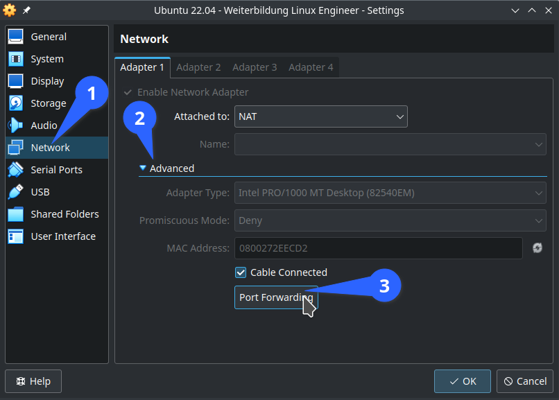
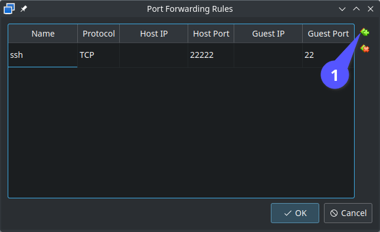

# Basic tools

```
stow vim git curl htop mc inxi tmux ncdu
```

# Sources

</br>

## Debian

</br>

### Source List

</br>

#### Format
- `deb [ option1=value1 option2=value2 ] uri suite [component1] [component2] [...]`
- `deb-src [ option1=value1 option2=value2 ] uri suite [component1] [component2] [...]`

</br>

#### Files
- /etc/apt/sources.list
- /etc/apt/sources.list.d/

</br>

#### Show standard source list:

```shell
cat /etc/apt/sources.list
```

Output on Debian GNU/Linux 11 (bullseye) aarch64:

```
deb http://deb.debian.org/debian bullseye main contrib non-free
deb http://security.debian.org/debian-security bullseye-security main contrib non-free
deb http://deb.debian.org/debian bullseye-updates main contrib non-free
# Uncomment deb-src lines below then 'apt-get update' to enable 'apt-get source'
#deb-src http://deb.debian.org/debian bullseye main contrib non-free
#deb-src http://security.debian.org/debian-security bullseye-security main contrib non-free
#deb-src http://deb.debian.org/debian bullseye-updates main contrib non-free
```

</br>

#### Add custom sources

Create separate `*.list` files in `/etc/apt/sources.list.d/`.

</br>

#### Resources:
- Debian manual: [Chapter 2. Debian package management](https://www.debian.org/doc/manuals/debian-reference/ch02.en.html)
- Debian man page: [SOURCES.LIST(5)](https://manpages.debian.org/bullseye/apt/sources.list.5.en.html)

-------------------

</br>

# Package Management

</br>

## Dpkg - apt, aptitude, synaptic, etc.

Dpkg is the base package manager for Debian. Apt, Aptitude, Synaptic etc. are tools and interfaces for Package Management, with additional features to dpkg.

[Dpkg - Homepage](https://www.dpkg.org/)
[Dpkg - Manpage](https://manpages.debian.org/dpkg.1.en.html)

</br>

### apt

Command line interface for package management.

Download package information from all configured sources:
```shell
sudo apt update
```
- `apt list --upgradable`

Update packages which are installed from the sources:
```shell
sudo apt upgrade
```

Update and upgrade:
```shell
sudo apt update && sudo apt upgrade -y
```

Search for packages:
```shell
apt search <PATTERN>
```

Install packages:
```shell
sudo apt install <PACKAGE_NAME>
```

Install a local deb package file:
```shell
sudo apt install ./STRATGE_APPLICATION.deb
```

Remove packages (keep the configuration files):
```shell
sudo apt remove <PACKAGE_NAME>
```

Remove packages (delete the configuration files):
```shell
sudo apt purge <PACKAGE_NAME>
```

</br>

### gdebi

Apt checks for dependencies of packages from online sources. But it doesn't do this, if you want to install from a local \*.deb file.

Gdebi solves this problem and checks for dependencies when installing a Package from a local \*.deb file.

- [debian.org - gdebi package](https://packages.debian.org/de/stable/gdebi)

Source `man gdebi`:

> NAME
> gdebi - Simple tool to install deb files
>
> SYNOPSIS
> gdebi [package.deb]...
>
> DESCRIPTION
> gdebi lets you install local deb packages resolving and installing its dependencies. apt does the same, but only for remote (http, ftp) located packages. It can also resolve build‐depends of debian/control files.


</br>

### aptitude

Text-based user interface for package management.

Start the interface:
```shell
sudo aptitude
```

| Short-key  | Function  |
| :--------: | --------- |
| `Ctrl`+`T` | Open Menu |
|    `?`     | Help      |
|    `q`     | Quit      |


### synaptic

Graphical management of software packages.

```shell
sudo apt install synaptic
```

</br>

### snap

Quote [Canonical - About Snaps](https://snapcraft.io/about) (Mrz 2023):
Snaps are app packages for desktop, cloud and IoT that are easy to install, secure, cross‐platform and dependency‐free. Snaps are discoverable and installable from the Snap Store

</br>

### Flatpak

- [flatpak.org - Flatpak Homepage](https://flatpak.org)
- [flathub.org - Flapak App Store](https://flathub.org/)

Description (from `man flatpak`):  
> Flatpak is a tool for managing applications and the runtimes they use. In the Flatpak model, applications can be built and distributed independently from the host system they are used on, and they are isolated from the host system ('sandboxed') to some degree, at runtime.

</br>

#### Installation

- [Official setup guide](https://flatpak.org/setup/)
- [Flatpak documentation](https://docs.flatpak.org)

</br>

Example installation on Debian ([Source](https://flatpak.org/setup/Debian)):  

```shell
sudo apt install flatpak
```

</br>

Add the Flathub repository:  

```shell
flatpak remote-add --if-not-exists flathub https://flathub.org/repo/flathub.flatpakrepo
```

</br>

Install the Flatpak plugin for GNOME Software:  

```shell
apt install gnome-software-plugin-flatpak
```

</br>

Location of config files from flatpak apps:  
```shell
cd ~/.var/app
```

</br>

#### Flatseal

Flatseal is a graphical utility to review and modify permissions from Flatpak applications. It is recommended, because flatpacks have an isolated environment and may have permission issues.

- [flathub.org - flatseal](https://flathub.org/apps/com.github.tchx84.Flatseal)
- [github.com - flatseal repo](https://github.com/tchx84/Flatseal)
- [github.com - flatseal documentation](https://github.com/tchx84/Flatseal/blob/master/DOCUMENTATION.md)

#### Flatpak Basic Commands

Install [Discord from Flathub](https://flathub.org/apps/com.discordapp.Discord):  
```shell
flatpak install flathub com.discordapp.Discord
```

Install Discord in user mode (for current user only): 
```shell
flatpak --user install flathub com.discordapp.Discord
```

</br>

Run Discord from terminal:  
```shell
flatpak run com.discordapp.Discord
```

</br>

List installed applications:  
```shell
flatpak list --app
```

</br>

Search for a flatpak app on [flathub.org](https://flathub.org) or via cli:  
```shell
flatpak search discord
```

</br>

Remove flatpak Discord app:  
```shell
flatpak uninstall com.discordapp.Discord
```
_If installed in user mode, you need to use: `flatpak --user uninstall com.discordapp.Discord`_

</br>

Uninstall unused flatpak runtimes: 
```shell
flatpak uninstall --unused
```

</br>

Update installed flatpak apps:  
```shell
flatpak update
# if installed in user mode
flatpak --user update
```


# [`dnf` - package manager](../commands_n_apps/dnf.md)

> [!quote] &nbsp;Excerpt from man page:
> 
> DESCRIPTION
> 
> DNF  is  the  next  upcoming major version of YUM, a package manager for RPM-based Linux distributions. It roughly maintains CLI compatibility with YUM and defines a strict API for extensions and plugins.

# Software  

## General

</br>

### ClamAV - Anti Virus

- [ClamAV - Homepage](https://www.clamav.net)
- [ClamAV - Documentation](https://docs.clamav.net)

**Installation on Kubuntu**

1. RAR Support 
	- `sudo apt install libclamunrar9`   
2. Install ClamAV Packages
	- `sudo apt install clamav clamav-base clamav-daemon clamav-docs clamav-freshclam clamav-milter`  
3. Check if Daemon is running
	- `clamdtop`
3. If you get errors, you might want reconfigure the Daemon
	- `sudo dpkg-reconfigure clamav-daemon`

</br>

### VirtualBox  

- [Download and installation manual](https://www.virtualbox.org/wiki/Linux_Downloads)  
- [VirtualBox.org - Download links](https://download.virtualbox.org/virtualbox/)

System info: `neofetch distro kernel shell de wm`  

| distro | Kubuntu 22.04.1 LTS x86_64 |
| ------ | -------------------------- |
| kernel | 5.15.0-60-generic          |
| shell  | bash 5.1.16                |
| de     | Plasma 5.24.7              |
| wm     | KWin                       |

1. Add VirtualBox repository: 

```shell
sudo cat << EOF | sudo tee /etc/apt/sources.list.d/virtualbox.list.tmp  
deb [arch=amd64 signed-by=/usr/share/keyrings/oracle-virtualbox-2016.gpg] https://download.virtualbox.org/virtualbox/debian jammy contrib  
EOF
```  
2. Download and register the corresponding key:  
```shell
wget -O- https://www.virtualbox.org/download/oracle_vbox_2016.asc | sudo gpg --dearmor --yes --output /usr/share/keyrings/oracle-virtualbox-2016.gpg
```  
3. Update package information:  
```shell
sudo apt update
```  
4. Install VirtualBox:  
```shell
sudo apt install virtualbox virtualbox-dkms virtualbox-ext-pack
```  

#### MISC VB stuff

Check Version of installed guest additions:  
```shell
# Linux:
VBoxClient --version

# Windows
VBoxControl.exe --version
```

> [!note] &nbsp;Connect via ssh from host to the VirtualBox VM
> 
> Thanks to: https://averagelinuxuser.com/ssh-into-virtualbox/#why-ssh-into-virtualbox
> 
> 0. VM (e.g. Ubuntu 22.04) is already created and has a functioning ssh server installed and configured - listening on port 22.
> 1. Open Settings of the VM.
> 2. Select "Network" (1) -> "Advanced" (2) -> "Port Forwanding" (3)
> 
> 
> 
> 3. Click the green plus icon (1) to add the new port forwarding rule.
> 4. Add the following rule:
>     - Name: `ssh`
>     - Protocol: `TCP`
>     - Host Port: `22222` (or any other free port on the host machine)
>     - Guest Port: `22` (ssh port on the vm)
> 
> 
> 
> 5. Confirm and save the changes.
> 6. Connect from host to the VM: `ssh -p 22222 vm-user-name@localhost`

## Command Line Software

- [GitHub.com - Modern Unix](https://github.com/ibraheemdev/modern-unix)

### neofetch

A fast, highly customizable system info script.  

- [Offizial GitHub repository](https://github.com/dylanaraps/neofetch)  
- [Neofetch Debian manpage](https://manpages.debian.org/bullseye/neofetch/neofetch.1.en.html)

```shell
sudo apt install neofetch
```

</br>

### iftop

Display live bandwidth usage on an interface by host.

- [Iftop Debian manpage](https://manpages.debian.org/bullseye/iftop/iftop.8.en.html)

```shell
sudo apt install iftop
```

</br>  

### sshto

- [GitHub: vaniacer / sshto](https://github.com/vaniacer/sshto) 

Quote:
> Small bash script to manage your ssh connections. It builds menu (via dialog) from your ~/.ssh/config. It can not only connect but also to run commands, copy files, tunnel ports. 

Clone the git repository:
```shell
git clone https://github.com/vaniacer/sshto.git
```

Or download the scrypt:

```shell
wget https://raw.githubusercontent.com/vaniacer/sshto/master/sshto
```


</br>

### screen

With screen you can run a session inside your current ssh session. For example detach it so it keeps running in the background, and reattach it later. This way you can have multiple sessions in one terminal or close the terminal without loosing the screen session.  

- [Screen Debian manpage](https://manpages.debian.org/bullseye/screen/screen.1.en.html)

</br>

Check if screen is installed:
```shell
which screen
```

</br>

Install Screen:  
```shell
sudo apt install screen
```

</br>

Start Screen session:  
```shell
screen -S <SESSION_NAME>
```
It's recommended to use the `-S` option to name the session, so you can identify it, when several screen session are running.  

Now your Screen session is started, so use it :)

Detach Screen session:  
`Ctrl+A` `Ctrl+D`

</br>

List active Screen sessions:  
```shell
screen -ls
```

</br>

Reattach Screen session:  
```shell
screen -r <SESSION_NAME>
```

</br>

To close the session use exit in an attached screen session:  
```shell
exit
```

</br>

## Desktop Software

</br>

### Synaptic - GUI package manager
```shell
sudo apt install synaptic
```

</br>

### Thunderbird - Mail + Kalender
```shell
sudo apt install thunderbird thunderbird-locale-de
```

</br>

### Filezilla - FTP-Client
```shell
sudo apt install filezilla 
```

</br>

### GParted - Partition manager
```shell
sudo apt install gparted
```

</br>

Driver for NTFS partitions:
```shell
sudo apt install ntfs-3g
```

</br>

### Krusader - file manager

Powerful, Total Commander and Midnight Commander like file manager. Homepage: https://krusader.org/

```shell
sudo apt install krusader
```

</br>

### Kate / Kwrite - Texteditor

- [Kate Website](https://kate-editor.org/)
- [Syntax Highlight](https://kate-editor.org/syntax/)
- [Alerts Syntax](https://kate-editor.org/syntax/data/html/test-alerts.dark.html)

</br>

Kate is a powerful text editor - focused on development.

```shell
sudo apt install kate markdownpart svgpart
```

</br>

KWrite is a simpler Kate editor.

```shell
sudo apt install kwrite
```

</br>

### Audacity - FOS cross-platform audio software

- [Official Project Website](https://www.audacityteam.org/)

</br>

## Server Software

</br>

### fail2ban

[Fail2ban Debian manpage](https://manpages.debian.org/bullseye/fail2ban/fail2ban.1.en.html)

```shell
sudo apt install fail2ban
```

</br>

#### Configuration

The jail.local configuration is given priority by fail2ban - jail.conf shouldn't be changed.

1. create jail.local by copying the jail.conf  
```shell
cp /etc/fail2ban/jail.conf /etc/fail2ban/jail.local
```

</br>

2. customise the configuration as preferred 

```shell
nano /etc/fail2ban/jail.local
```

Useful changes:
```shell
# Dauer des IP-Bans
bantime  = 24h
# Dauer in der die Anzahl (maxretry) der Fehlversuche stattfinden müssen
findtime  = 1h
# Anzahl der Fehlversuche bis zum Bann binnen findtime
maxretry = 3
```

```shell
service fail2ban restart
```

</br>

#### Status of the service
```shell
fail2ban-client status
```

</br>

Output: 
```shell
Number of jail:      1
Jail list:   sshd
```

</br>

Info from sshd jail list:
```shell
fail2ban-client status sshd
```

</br>

#### Resources:
- https://www.the-art-of-web.com/system/fail2ban-log/
- https://www.youtube.com/watch?v=GpxAjl58qRU
